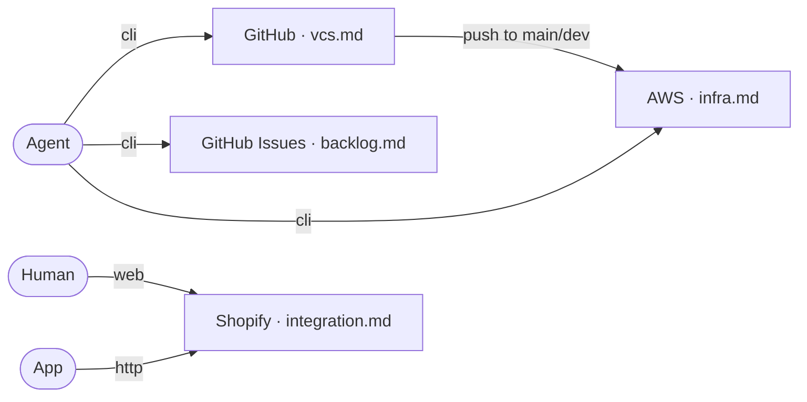

# Ecosystem

```mermaid
flowchart LR
  Human([Human])
  Agent([Agent])
  App([App])
  Vcs["GitHub · vcs.md"]
  Tracker["GitHub Issues · backlog.md"]
  Shopify["Shopify · integration.md"]
  Aws["AWS · infra.md"]

  Agent -- cli --> Vcs
  Agent -- cli --> Tracker
  Agent -- cli --> Aws
  Human -- web --> Shopify
  App -- http --> Shopify

  Vcs -- "push to main/dev" --> Aws
```
